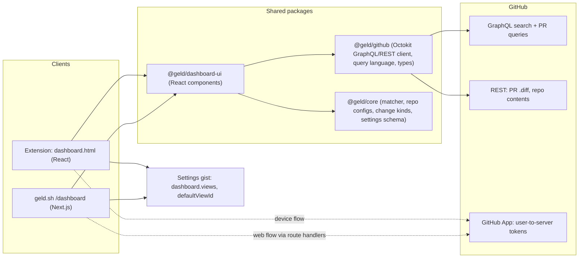

# Geld Dashboard and In-Geld Review

Handoff plan for another agent. Decisions already taken: access comes from a **GitHub App** (not the `repo` OAuth scope); the review view ships **read-only first**, writes second. Everything is built on GitHub's GraphQL/REST API through Octokit; Geld still runs no server of its own beyond the existing Next.js route handlers on geld.sh.

## Goals

- One dashboard, two homes: a new full-page view in the extension (`dashboard.html`, linked from the popup footer and the options page) and `/dashboard` on geld.sh for signed-in users. Same UI, same data layer.
- Default landing: pull requests the user is involved in across every repository (`is:pr is:open involves:@me`), because "everything everywhere" is not loadable.
- Scope down or across with an org → repo combobox (multi-select) and GitHub's own filter vocabulary, editable as a query string and through dropdowns that write into that string, exactly as GitHub's list does.
- Saved views (a query plus a repo selection), pinned on the landing page, one of which can be the default that replaces the landing list.
- Review a PR inside Geld: a simplified changes view that applies the user's categories, repo configs, trivial-change kinds and comment-line hiding, with hidden files collapsible like on GitHub. Phase 2 adds line selection, comments, review submission and "trigger review bot" commands.

## Non-goals (v1)

- Issues, discussions, notifications.
- Replacing GitHub's conversation tab; the review view links out for anything it does not render.
- A Geld backend or database. Saved views live in the settings gist; tokens live where the existing ones do.

## Architecture



Key points:
- **React in the extension.** The popup/options are vanilla TS today; the dashboard and review view are far too large to write twice or without a framework. Add React to `apps/extension` for the two new entrypoints only (WXT supports this), and put the shared UI in a new workspace package `packages/dashboard-ui` styled with the same tokens as [apps/extension/src/ui/base.css](apps/extension/src/ui/base.css) / [apps/site/app/globals.css](apps/site/app/globals.css). Popup and options stay as they are.
- **Query language = GitHub's.** The dashboard's filter string is passed verbatim to GraphQL `search(type: ISSUE, query: "is:pr …")`, so every GitHub qualifier (`author:@me`, `involves:@me`, `review-requested:@me`, `label:`, `is:draft`, `org:`, `repo:`, `sort:`) works on day one and saved views are just strings. The filter dropdowns are sugar that read/write tokens in that string, mirroring GitHub's list.
- **Access.** One GitHub App, "Geld", for everything: it replaced the OAuth App for settings sync too (its Gists account permission covers the gist), so a user authorizes once. Users *authorize* (device flow in the extension, web flow on geld.sh) to sign in; that alone lets Geld read any **public** repository (user tokens have implicit read access to public resources) and sync settings. Users *install* the App on their personal account and on each org whose **private** pull requests they want in the dashboard; the dashboard shows an inline "Install Geld on … to include its private pull requests" prompt (from `GET /user/installations`, deep link `…/installations/new/permissions?target_id=<id>`) exactly where something is missing, never up front. Writes (comments, reviews) most likely also need the App installed on the repository, so the review view links out to GitHub for commenting on repositories where it is not (verify on the test install; first item under risks). Hiding files on github.com needs neither authorization nor installation and is unchanged.

## GitHub App setup (done, Sep 2026)

Registered under @brandonmcconnell as "Geld", installable on any account. Decisions, in case it ever has to be re-created:

1. Callback URLs `https://www.geld.sh/auth`, `http://localhost:3000/auth` (local dev uses the same App), `https://preview.geld.sh/auth` (unused until a fixed preview alias exists and `authConfig()` allows it). **Device flow on**, "Request user authorization (OAuth) during installation" on, **"Expire user authorization tokens" on** (8 h tokens, 6-month rotating refresh tokens; refresh is implemented in `@geld/github`, device-flow tokens refresh without the secret). Webhook off; no private key (Geld never acts as the app).
2. Permissions: Repository → Metadata read, Contents read (repo configs, `.gitattributes`), Checks read and Commit statuses read (row checks rollup), **Pull requests read and write**, **Issues read and write** (conversation comments incl. bot commands, labels, reactions). Account → **Gists read and write** (settings sync). Organization → none. **Contents write is deliberately not requested**: it is only needed for merging, applying suggestions and writing to repositories; it goes on every install screen as "read and write access to code". Raise it together with the feature that needs it (Merge from the dashboard), with a "when Geld writes and why" section on `/privacy`; adding a permission later shows installation owners one "Accept new permissions" prompt and breaks nothing until then (a 403 with `X-Accepted-GitHub-Permissions` names the missing permission, so `@geld/github` writes are permission-aware from day one and the UI can link to the acceptance page).
3. Variables: `GELD_APP_CLIENT_ID` + `GELD_APP_CLIENT_SECRET` in Vercel (Production and Development; Preview has none), `WXT_GELD_APP_CLIENT_ID` as a GitHub Actions variable and in `apps/extension/.env`. The old OAuth App's `GITHUB_CLIENT_ID`/`GITHUB_CLIENT_SECRET` stay in Vercel only to revoke its tokens during the migration period. Public install link `https://github.com/apps/geld/installations/new` goes in the dashboard's empty state.

**Settings store: the gist stays.** A private `user/.geld` repository was considered (truly private, directories, PRs) and rejected for now: Geld cannot create a repository without Administration write, cannot read a private one without an installation, and cannot write to one without Contents write or a Single-file permission; the gist needs one account permission and zero setup, and a multi-file gist covers the structure use cases (per-target override files, category packs, saved views) with a naming convention. If privacy of the settings themselves ever matters, the shape to build is: user creates `.geld` from a template, App gets Single file read/write on fixed paths, personal repo layered under org `.geld` repos. Not before.

**Migration from the OAuth App (shipped with milestone 1).** Existing sign-ins keep working (OAuth tokens do not expire) and every settings surface (popup, options page, geld.sh) shows the undismissable `RECONNECT_COPY` notice until the user signs in again through the App. The site revokes the old token on reconnect and sign-out (it holds the legacy secret); the extension just forgets its copy. Remove the legacy env vars and the `oauth` code paths once the notice has been out for a few releases.

## Package: `@geld/github` (new, `packages/github`)

- **Done:** `auth.ts` — device flow (`requestDeviceCode`/`pollDeviceCode`), web flow (`authorizeUrl`/`exchangeCode`), `refreshTokens`, `revokeToken`, and `createTokenSource`, the single-owner refresh coordinator (refresh five minutes ahead, one in-flight refresh, `rejected` → sign out vs `unavailable` → keep the token). Extension: `withToken` in `account-service.ts` (background only). Site: `resolveSession(config, writable)` in `lib/auth/session.ts` (inline refresh in actions/routes, `/auth/refresh` for pages).
- Octokit GraphQL + REST clients taking a `TokenSource` (extension: the background's; site: per-request from the session cookie, calls proxied through route handlers so the token never reaches the browser). Every write maps a 403 with `X-Accepted-GitHub-Permissions` to a typed "needs permission" result.
- `searchPullRequests(query, cursor)` → `{ nodes: PullRequestSummary[], pageInfo }` (number, title, repo, author + avatar, labels, review decision, checks rollup, draft, updatedAt, additions/deletions, changedFiles).
- `suggestRepositories(text)`: union of `viewer.repositories(affiliations: OWNER, COLLABORATOR, ORGANIZATION_MEMBER)`, `viewer.repositoriesContributedTo` ("written to in the past"), and `search(type: REPOSITORY)` for arbitrary names; returns `owner/name` + owner avatar, de-duplicated, ranked contributed > member > public.
- `suggestOrganizations(text)`: viewer orgs plus `search(type: USER, query: "type:org …")`.
- `getPullRequest(owner, repo, number)` (metadata, head/base SHA, files list) and `getPullRequestDiff` (REST `Accept: application/vnd.github.diff`).
- Query-string helpers in pure TS: `parseQuery` / `serializeQuery` (tokens ↔ `{ qualifiers, freeText }`), `setQualifier`, `removeQualifier`, `withRepos(query, repos[])` (writes `repo:` tokens; multiple repos are OR'd by GitHub search).
- Phase 2: `addReviewThread`, `submitReview`, `postComment`.
- Unit tests with recorded GraphQL fixtures; no live calls in CI.

## Dashboard UX

**Layout** (both homes): left rail with "Involved", "Mine", "Review requested" presets and the user's saved views (pinned, reorderable, default marked); main area with the query bar, filter dropdowns (Author, Involves, Label, Review, State/Draft, Sort), the org/repo combobox, results list, "Show more" (cursor pagination; infinite scroll is a later toggle). Each row: repo, number, title, author avatar, labels, review decision, checks, and Geld's own `+N −M excluding hidden files` chip (reusing the `.diff` fetch + `breakdownFromFiles` from the extension's PR-list logic, lazily per visible row, exactly like [apps/extension/src/github/pr-list.ts](apps/extension/src/github/pr-list.ts)). Row click opens the in-Geld review view; a secondary link opens GitHub.

**Org/repo combobox** (one component, `RepoPicker`):
- Two inputs visually joined: owner, then repository. Typing filters suggestions (avatar + `owner/name`) from `suggestRepositories`; results the user has written to rank first, public matches below.
- Typing `/` in the owner input commits the owner and moves focus to the repo input (the slash is not inserted). Pasting `owner/repo` (or a GitHub URL) splits into both inputs and shows that repo as the top suggestion; Enter (or click) selects it.
- Multi-select: each selection becomes a chip; the query gains `repo:owner/name` tokens. Selecting an owner with no repo adds `org:owner` (or `user:owner`).
- Everything the picker does is expressed in the query string, so the string is the single source of truth and the picker just edits it.

**Saved views**: `Save view` on the current query + selection → name it, optional pin, optional "make default". Stored in the settings gist so they follow the user across devices and both homes. Landing page shows the default view's results when one is set, otherwise "Involved".

**Filters as query tokens**: dropdown choices insert or replace tokens (`author:@me`, `involves:@me`, `review-requested:@me`, `label:"bug"`, `is:draft`, `sort:updated-desc`); editing the string updates the dropdowns' selected state. Invalid strings show GitHub's error text under the bar.

## Settings model (in `@geld/core`)

Add to `GeldSettings` in [packages/core/src/settings.ts](packages/core/src/settings.ts):

```ts
readonly dashboard: {
  readonly views: readonly SavedView[];     // { id, name, query, pinned, createdAt }
  readonly defaultViewId: string | null;
};
```

Normalize + strict validation in [packages/core/src/settings-validate.ts](packages/core/src/settings-validate.ts) (ids unique, query non-empty, default refers to an existing view), listed in [packages/core/src/repo-config.ts](packages/core/src/repo-config.ts) `PERSONAL_KEYS`. Not a schema field (it has its own UI), but exported/imported with the rest.

## Review view (phase 1, read-only)

- Routes: site `/review/[owner]/[repo]/[number]`; extension `dashboard.html#/review/owner/repo/number`.
- Data: PR metadata + full `.diff` text. Extend [packages/core/src/diff-parse.ts](packages/core/src/diff-parse.ts) with a full hunk/line parser (`parseUnifiedDiffFull`) that keeps the existing `FileStats` output as-is; the review view needs lines, the rest of Geld does not.
- Classification: `createMatcher(applyRepoConfigs(settings, configs), repo, catalog)` with repo configs fetched through `@geld/github` (`.github/geld.yml`, org `.github`, `.gitattributes`), `categorizeFile` with change kinds, comment-line collapsing — the same functions the content script uses, so the file set matches GitHub-with-Geld exactly.
- Rendering: `react-diff-view` (unified/split, hunk widgets for phase-2 comments) with `refractor` highlighting; a left file tree grouped like Geld's accordion (Changes, then one panel per hidden category); hidden files collapsed in a bottom section with "Show hidden files"; per-file "Mark as viewed" persisted locally (GitHub's viewed state is per-user via GraphQL `markFileAsViewed`, phase 2).
- Header: `+N −M` excluding hidden, `N hidden` with the tooltip breakdown; links to GitHub's tabs.

## Review view (phase 2, writes)

- Pull requests and Issues write are already granted; nothing to bump. Comments on repositories where the App is not installed link out to GitHub (see Access).
- Select a line or range → comment widget → `addPullRequestReviewThread` (pending review) → "Submit review" (approve / comment / request changes) via `submitPullRequestReview`; existing threads rendered inline from `reviewThreads`.
- "Trigger review bot": a small list of configurable commands (e.g. `@coderabbitai review`, `/review`) posted as issue comments; stored with the saved views in settings.
- Mark viewed through GraphQL so it syncs with GitHub.

## Extension integration

- New WXT entrypoints `entrypoints/dashboard/` (React). Sign-in is already the App's device flow in [apps/extension/src/lib/account-service.ts](apps/extension/src/lib/account-service.ts); the dashboard asks the background for a token (a `geld:account` message returning `TokenAccess`) rather than reading `storage.local` itself, so refreshes stay single-owner.
- Popup footer ([apps/extension/entrypoints/popup/index.html](apps/extension/entrypoints/popup/index.html)): add "Dashboard" next to "All settings". Options page: a card linking to it.
- No new host permissions: `api.github.com` is already granted.

## Site integration

- `/dashboard` and `/review/...` pages behind the existing session (`resolveSession`; App sign-in is already the only flow in [apps/site/app/auth](apps/site/app/auth)); route handlers `/api/github/*` that call `@geld/github` with the session's token, refreshing inline. Preview deployments keep refusing sign-in as today.
- Header gets a "Dashboard" link when signed in and connected.

## Milestones (one commit each, shippable)

1. `@geld/github` package: clients, queries, query-string helpers, fixtures + tests. *Done:* GitHub App created; connect flows on both homes (device + web) with token refresh and the OAuth → App reconnect notice. *Left:* the clients and the "Install Geld on …" empty state.
2. `@geld/dashboard-ui`: results list, query bar with dropdown ↔ string sync, RepoPicker with slash/paste behaviour and multi-select chips, Show more. Extension `dashboard.html` + popup/options links; site `/dashboard`.
3. Saved views: settings model + validation, sidebar, pin/default, gist sync on both homes.
4. Review view phase 1 (full diff parser, classification reuse, tree + hidden section, viewed state).
5. Review view phase 2 (write permission, threads, submit review, bot commands, GraphQL viewed state).

## Risks and checks to do first

- Confirm on the test install what a user token can do on a repository where the App is **not** installed: reading public repos is documented (implicit read access to public resources); writing (a review comment on a public PR) is expected to fail and needs the link-out fallback. If public reads ever fail too, fall back to unauthenticated REST for public repos in `@geld/github`.
- Token expiry is handled (`createTokenSource`); keep every new GitHub call behind it, never read `account.token` / the cookie directly.
- Search API caps at 1,000 results per query and rate-limits GraphQL by points; keep page size 25–30, cache pages per query in memory and `storage.local` for a few minutes, fetch chips lazily.
- Bundle size: React + diff viewer only in the dashboard entrypoints, never in the content script.
- Per-repo settings today are the `[owner/repo]` scoped pattern lines and repository configs; both are honoured through `createMatcher` + `applyRepoConfigs`, so the review view needs no new settings concept.
