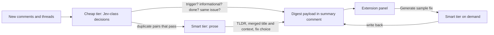

# Pretext and AI tiering for the review digest

## Context for whoever picks this up

Branch `cursor/pr-review-summary-9b3f`, PR [#10](https://github.com/brandonmcconnell/geld/pull/10) (do not merge; the owner decides). The feature is behind the `prOverview` switch in the new **Experiments** settings section (commit `0766c3c`). Verify live with the harness in `/tmp/geld-fixture` (`start-headed.sh` in tmux session `geld-chrome`, `drive.sh` for eval/click/hover/shot; rebuild with `pnpm --filter @geld/extension run build:chrome`, then restart the harness) against `https://github.com/mintlify/mint/pull/10271` (22 resolved threads, Bugbot/Devin/Greptile, trimmed paths) and the merged `#11462`. `AGENTS.md` describes every mechanism named below; read its review-panel bullets first.

Key facts established in this session that the plan relies on:

- Pretext is a text measurement and line-breaking engine, not a UI analyser: `prepareWithSegments(text, canvasFont)` measures once via canvas, then `measureNaturalWidth` / `layout` / `walkLineRanges` answer fit questions with pure arithmetic and no reflow. Constraints: the font string must match CSS exactly (`fontOf()` in `path-fit.ts` builds it), it needs a canvas (so logic that must be unit-tested takes an injected measurer, as `fitPath` does), and it knows nothing about the box model. Version pinned `0.0.9`; `@chenglou/pretext/rich-inline` handles mixed fonts and atomic chips (`break: 'never'`, `extraWidth`).
- Already using it: [apps/extension/src/github/review/path-fit.ts](apps/extension/src/github/review/path-fit.ts) (`fitPath`, `fitPathInto`, tests in `path-fit.test.ts`).
- AI today: prompts and schemas in [packages/review/src/prompts.ts](packages/review/src/prompts.ts) (`CONSOLIDATE_SYSTEM`, `SUMMARY_SYSTEM`, `ADDRESSED_SYSTEM`, JSON schemas, parsers); incremental plan/apply in [packages/review/src/consolidate.ts](packages/review/src/consolidate.ts) (`planConsolidation` carries items by anchor set, `fixVisible`); one OpenAI-compatible client in [packages/review/src/ai-client.ts](packages/review/src/ai-client.ts) (`completeChat`, `listModels`). The Action ([apps/action/src/main.ts](apps/action/src/main.ts)) runs consolidation when given a key; the browser path is [apps/extension/src/github/review/ai.ts](apps/extension/src/github/review/ai.ts) (`consolidateInBrowser`, in-memory `rewrites`) calling the background's `geld:ai-complete` message (key in `local:aiKey`). `ReviewItem.fix?: SuggestedFix { text, source: 'bot' | 'ai' | 'human' }` in [packages/review/src/model.ts](packages/review/src/model.ts); the model may return `fix` today in `CONSOLIDATE_JSON_SCHEMA`.
- Per-PR state: the Action writes the digest JSON into the one Geld summary comment (`renderSummary` in `summary-render.ts`, `upsertIssueComment` in [apps/action/src/github.ts](apps/action/src/github.ts)); the extension reads it (`findSummaryComment`, only `ALLOWED_SUMMARY_AUTHORS`). The extension keeps only per-visit memory and `storage.local`. The signed-in Geld App token (device flow, `withToken` in `src/lib/account-service.ts`) has Pull requests and Issues read/write.
- Trigger detection is heuristic in `isTriggerComment` ([packages/review/src/bots.ts](packages/review/src/bots.ts)); dedup of bot findings is by path/line clustering in `cluster.ts`.

## Part 1: pretext, in order of value

1. **Hover cards and tooltips** ([apps/extension/src/github/review/hovercard.ts](apps/extension/src/github/review/hovercard.ts) `place()`, [apps/extension/src/github/ui/tooltip.ts](apps/extension/src/github/ui/tooltip.ts)): compute the card's width and wrapped height from its text with `layout()` before insertion, so positioning is one write instead of insert, measure, reposition (a forced layout mid-hover).
2. **Every ellipsized row and chip**: round and item titles in `panel.ts` (`__title`, `__detail`), the Reviews list previews, list-surface chips (`src/github/list-surfaces.ts`, `pr-list.ts`) and the "N files hidden" row. Replace CSS `text-overflow` where the cut position matters (paths: middle; titles: end; chips: text truncates, counts never) with pretext-decided text, refitted on resize as `fitPathInto` does. Use `rich-inline` for chips: text + atomic bullet + counts with `break: 'never'`, replacing the float tricks in `list-surfaces.ts`.
3. **Virtualising long lists**: rounds with dozens of threads, the Reviews list on PRs with hundreds of comments, the commits fold. `layout()` gives row heights without rendering; window the `__rows--sub` lists once heights are known (only after 1 and 2).
4. **Site**: build-time checks that OG image and demo copy fit (`apps/site/app/opengraph-image.tsx`, `components/demo/`), balanced settings descriptions.
5. Not for: anything about GitHub's markup or deciding what to fold.

## Part 2: AI tiering

Rule: a cheap decision-only model (Jev-class) for anything with a small closed answer set that runs per comment; a smart model only for prose a person reads or a change they might apply.

**Cheap tier (new `packages/review/src/decisions.ts`, schemas in `prompts.ts`), each returning a label plus confidence, cached by content hash of comment body + bot + head SHA so verdicts carry across pushes like `planConsolidation` carries titles:**
- Is this comment purely a bot trigger? Fallback for what `isTriggerComment` cannot settle; the heuristic still short-circuits the obvious majority.
- Is this thread done? The "above 90% confidence" auto-resolve idea; the display may show the verdict, the action (resolving) is gated on the threshold.
- Is this comment informational or actionable? Decides Source-toggle material vs. a thread item (`ReviewItem`).
- Do these two bot findings describe the same issue? Pairwise, only for findings on the same file within a line window; pairs that pass go to the smart tier.
- Which bot / which round does an orphan comment belong to.
- **Fix selection** (owner's call: Jev is acceptable here): when consolidated sources carry more than one bot `suggestion`, decide whether they are the same change; if not, whether they address the same problem; if so, pick the objectively better one or mark them for consolidation. Only "consolidate" escalates to the smart tier.

**Smart tier (existing `completeChat`, existing model settings):**
- TL;DR (`SUMMARY_SYSTEM`), once per push and only when the open set changed (already incremental).
- Merged title and context for clusters the cheap tier confirmed (`CONSOLIDATE_SYSTEM`, on a handful of clusters, not the cross-product).
- Fix consolidation when the cheap tier said two bot fixes solve the same problem differently.
- Planned per-comment actions ("explain", "help me respond"), user-initiated.
- **Fix generation, on demand only** (below). Remove `fix` from `CONSOLIDATE_JSON_SCHEMA` and `applyConsolidation`: consolidation never generates a fix.

**Where it runs:** the cheap tier in the Action so every reader gets the same triage without a key and its output ships in the digest payload; the extension's BYOK path only pays for the smart tier when the Action did not run. Add Action inputs for the cheap model (gateway URL, model id, key) alongside the existing AI inputs in [apps/action/action.yml](apps/action/action.yml).

## Part 3: "Generate sample fix"

- Consolidation reuses bot-provided fixes: one bot fix becomes the item's `fix` (`source: 'bot'`); several go through the cheap selector above; a smart consolidation yields `source: 'ai'`. Nothing is generated eagerly.
- An item without a fix shows a **Generate sample fix** button inside its thread frame content (below the Source/path head in `renderThreadsView`, [apps/extension/src/github/review/quick-view.ts](apps/extension/src/github/review/quick-view.ts)), prominent, not in the ellipsis menu for now. Clicking it calls the smart tier with the item's sources, merged context, the thread's diff snippet and the file's current content (fetched via the page origin as `repo-config-source.ts` fetches raw files), shows the existing shimmer while pending, then renders the fix in the existing `notesFor` block with Copy.
- **Storage (owner's choice): write the generated fix straight back into the Geld summary comment's JSON** via the signed-in App token: read the comment, `parseSummaryElement`, set `items[id].fix = { text, source: 'ai' }`, `renderSummary`, PATCH `/repos/{owner}/{repo}/issues/comments/{id}` through `withToken` in the background (new message `geld:review-write-fix`). Requirements and fallbacks: the comment keeps its author, so the extension keeps trusting it; editing needs the user to have write access on the repo, so on 403 fall back to `storage.local` (`local:reviewFixes`, key `github:{owner}:{repo}:{pull}` to item id to fix + head SHA) and say so in the button's status; the Action's next run must carry `fix` for items whose anchor set is unchanged (extend `planConsolidation`'s carry to include `fix`), otherwise a generated fix would be lost on the next push. Mark generated fixes with the head SHA and label them stale in the UI when the head moved.
- `suggestedFixes` setting semantics stay: `bots` shows bot fixes and the button; `ai` shows AI fixes and the button; `off` hides both.

## Order of work

Part 3 first (it changes the digest payload and the Action, and is the user-visible feature), then Part 2's cheap tier in the Action with the fix selector, then Part 1 items 1 and 2; items 3 to 5 as follow-ups.
